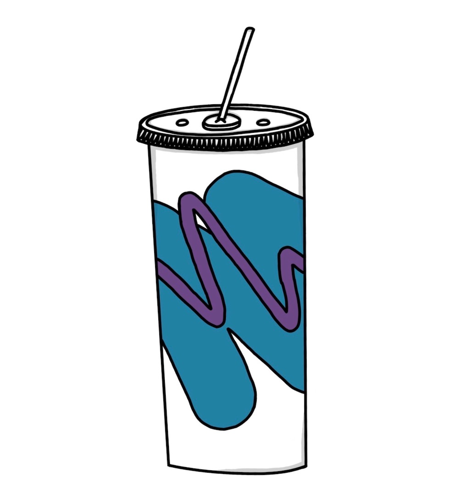
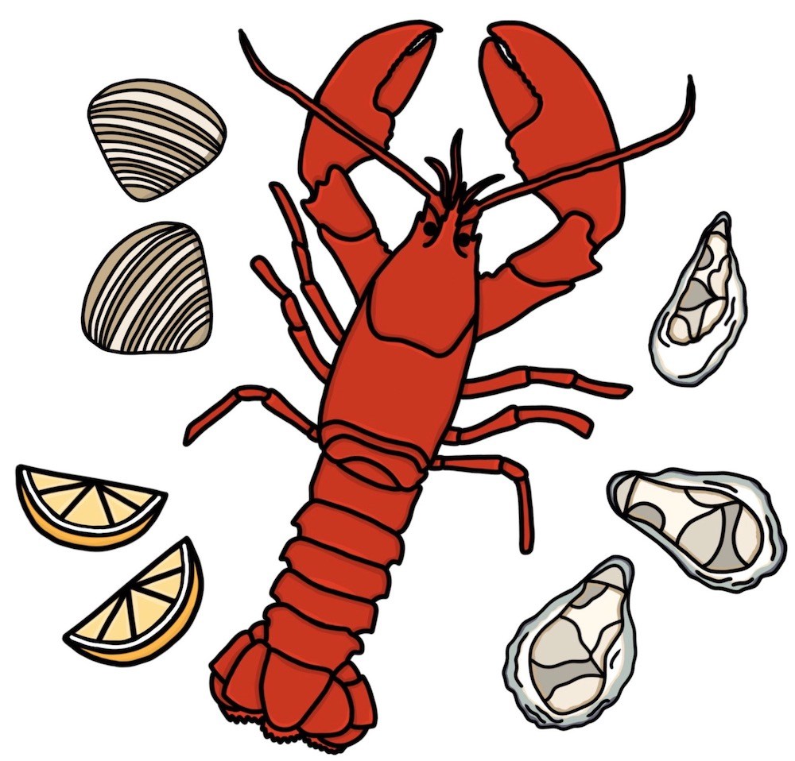
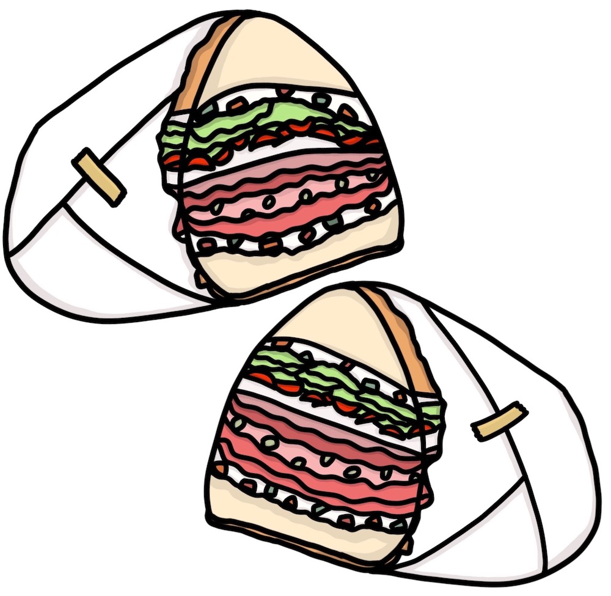

<!DOCTYPE html>
<html>
  <head>
    <title>Boston Accent Generator</title>
    <link rel="stylesheet" href="style.css" />
    <link
      href="https://fonts.googleapis.com/css2?family=Oswald&family=Pacifico&display=swap"
      rel="stylesheet"
    />
    <link
      href="https://fonts.googleapis.com/css2?family=Inconsolata:wght@200;300;400;500;600;700;800;900&display=swap"
      rel="stylesheet"
    />
  </head>
  <body>
    

      

        

          
          
          
        

        <h1 class="title">Boston Accent Generator</h1>
        

          <label for="input" id="question" class="section"
            >Enter a word or phrase to learn its Bostonian pronunciation:</label
          >
           
          <input type="text" id="user-input" class="section" required />
          <button id="button" class="button" onclick="bostonify()">
            Enter
          </button>
        

        

        

          
          
          
        

      

      <footer>
        
© Claudia Robinson 2020

      </footer>
    

    
  </body>
</html>
